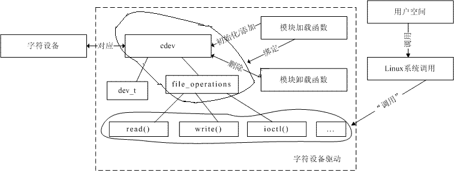
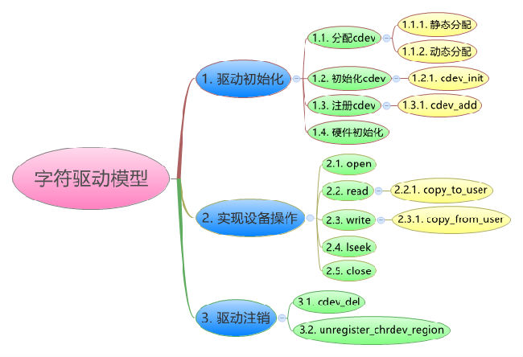

# Linux大作业第三题-------分析一个字符设备驱动程序结构 #

**字符设备**：是指只能一个字节一个字节读写的设备，不能随机读取设备内存中的某一数据，读取数据需要按照先后数据。字符设备是面向流的设备，常见的字符设备有鼠标、键盘、串口、控制台和LED设备等。

## 一、字符设备、字符设备驱动与用户空间访问该设备的程序三者之间的关系。 

如图，在Linux内核中使用`cdev`结构体来描述字符设备，通过其成员`dev_t`来定义设备号（分为主、次设备号）以确定字符设备的唯一性。通过其成员`file_operations`来定义字符设备驱动提供给VFS的接口函数，如常见的`open()`、`read()`、`write()`等。

在Linux字符设备驱动中，模块加载函数通过`register_chrdev_region( )` 或`alloc_chrdev_region( )`来静态或者动态获取设备号，通过`cdev_init( )`建立`cdev`与`file_operations`之间的连接，通过`cdev_add( )`向系统添加一个`cdev`以完成注册。模块卸载函数通过`cdev_del( )`来注销`cdev`，通过`unregister_chrdev_region( )`来释放设备号。

用户空间访问该设备的程序通过Linux系统调用，如`open( )`、`read( )`、`write( )`，来“调用”`file_operations`来定义字符设备驱动提供给VFS的接口函数。

##二、字符设备驱动模型

###1. 驱动初始化

####1.1. 分配cdev

在2.6的内核中使用cdev结构体来描述字符设备，在驱动中分配cdev,主要是分配一个cdev结构体与申请设备号，以按键驱动为例：

	/*……*/
	/* 分配cdev*/
	struct cdev btn_cdev;
	/*……*/
	/* 1.1 申请设备号*/
 	   if(major){
  	      //静态
  	      dev_id = MKDEV(major, 0);
  	      register_chrdev_region(dev_id, 1, "button");
  	  } else {
   	     //动态
   	     alloc_chardev_region(&dev_id, 0, 1, "button");
    	    major = MAJOR(dev_id);
    	}
	/*……*/

从上面的代码可以看出，申请设备号有动静之分，其实设备号还有主次之分。

在Linux中以主设备号用来标识与设备文件相连的驱动程序。次编号被驱动程序用来辨别操作的是哪个设备。`cdev` 结构体的 `dev_t` 成员定义了设备号，为 32 位，其中高 12 位为主设备号，低20 位为次设备号。

&emsp;&emsp;&emsp;设备号的获得与生成：

&emsp;&emsp;&emsp;获得：主设备号：MAJOR(dev_t dev);

&emsp;&emsp;&emsp;&emsp;&emsp;&emsp;次设备号：MINOR(dev_t dev);

&emsp;&emsp;&emsp;&emsp;&emsp;&emsp;生成：MKDEV(int major,int minor);

&emsp;&emsp;&emsp;&emsp;&emsp;&emsp;设备号申请的动静之分：

&emsp;&emsp;&emsp;&emsp;&emsp;&emsp;静态：   

	int register_chrdev_region(dev_t from, unsigned count, const char *name)；
	/*功能：申请使用从from开始的count 个设备号(主设备号不变，次设备号增加）*/

 &emsp;&emsp;&emsp;&emsp;&emsp;&emsp;静态申请相对较简单，但是一旦驱动被广泛使用,这个随机选定的主设备号可能会导致设备号冲突，而使驱动程序无法注册。

 &emsp;&emsp;&emsp;&emsp;&emsp;&emsp;动态：

	int alloc_chrdev_region(dev_t *dev, unsigned baseminor, unsigned count,const char *name)；
	/*功能：请求内核动态分配count个设备号，且次设备号从baseminor开始。*/

动态申请简单，易于驱动推广，但是无法在安装驱动前创建设备文件（因为安装前还没有分配到主设备号）。

####1.2. 初始化cdev

void cdev_init(struct cdev *, struct file_operations *); 

cdev_init()函数用于初始化 cdev 的成员，并建立 cdev 和 file_operations 之间的连接。

####1.3. 注册cdev

int cdev_add(struct cdev *, dev_t, unsigned);

cdev_add()函数向系统添加一个 cdev，完成字符设备的注册。

####1.4. 硬件初始化
硬件初始化主要是硬件资源的申请与配置，以TQ210的按键驱动为例：

	/* 1.4 硬件初始化*/
    	//申请GPIO资源
    	gpio_request(S5PV210_GPH0(0), "GPH0_0");
    	//配置输入
    	gpio_direction_input(S5PV210_GPH0(0));

###2.实现设备操作

 用户空间的程序以访问文件的形式访问字符设备，通常进行`open`、`read`、`write`、`close`等系统调用。而这些系统调用的最终落实则是`file_operations`结构体中成员函数，它们是字符设备驱动与内核的接口。以TQ210的按键驱动为例：

	/*设备操作集合*/
	static struct file_operations btn_fops = {
   	 	.owner = THIS_MODULE,
    	.open = button_open,
    	.release = button_close,
    	.read = button_read
	};

上面代码中的`button_open`、`button_close`、`button_read`是要在驱动中自己实现的。`file_operations`结构体成员函数有很多个，下面就选几个常见的来展示：

####2.1. open（）函数

原型：

	int(*open)(struct inode *, struct file*); 
	/*打开*/

案例：

	static int button_open(struct inode *inode, struct file *file){
    	unsigned long flags;
    	//获取分配好的私有数据结构的首地址
    	struct button_priv *pbtnp = container_of(inode->i_cdev, 
                                             struct button_priv, 
                                             btn_cdev);
    	//保存首地址到file->private_data
    	file->private_data = pbtnp;
    	if(down_interruptible(&pbtnp->sema)){
        	printk("Proccess is INT!\n");
        	return -EINTR;
    	}
    	printk("open button successfully !\n");
    	return 0;
	}

####2.2. read( )函数

原型：

	ssize_t(*read)(struct file *, char __user*, size_t, loff_t*); 
	/*用来从设备中读取数据，成功时函数返回读取的字节数，出错时返回一个负值*/

案例：

	static ssize_t button_read(struct file *file, char __user *buf,
                size_t count, loff_t *ppos){
    	//获取首地址
    	struct button_priv *pbtnp = file->private_data;
    	//判断按键是否有操作，如果有，则读取键值并上报给用户；反之，则休眠
    	wait_event_interruptible(pbtnp->btn_wq, is_press != 0);
    	is_press = 0;
    	//上报键值
    	copy_to_user(buf, &key_value, sizeof(key_value));
    	return count;
	}
	/*参数：file是文件结构体指针，buf是用户空间内存的地址，该地址在内核空间不能直接读写，
  	count 是要读的字节数，ppos是读的位置相对于文件开头的偏移*/

####2.3. write( )函数

原型：

	ssize_t(*write)(struct file *, const char__user *, size_t, loff_t*);
	/*向设备发送数据，成功时该函数返回写入的字节数。如果此函数未被实现，
  	当用户进行write()系统调用时，将得到-EINVAL返回值*/

案例：

	static ssize_t mem_write(struct file *filp, const char __user *buf, 
                         size_t size, loff_t *ppos){
    	unsigned long p =  *ppos;
    	unsigned int count = size;
    	int ret = 0;
    	int *register_addr = filp->private_data; /*获取设备的寄存器地址*/ 
    	/*分析和获取有效的写长度*/
    	if (p >= 5*sizeof(int))
        	return 0;
    	if (count > 5*sizeof(int) - p)
        	count = 5*sizeof(int) - p;   
    	/*从用户空间写入数据*/
    	if (copy_from_user(register_addr + p, buf, count))
        	ret = -EFAULT;
    	else {
        	*ppos += count;
        	ret = count;
    	}
    	return ret;
	}
	/*参数：filp是文件结构体指针，buf是用户空间内存的地址，该地址在内核空间不能直接读写，
  	count 是要读的字节数，ppos是读的位置相对于文件开头的偏移*/

####2.4. close( )函数

原型：

	int(*release)(struct inode *, struct file*); 
	/*关闭*/

案例：

	static int button_close(struct inode *inode, struct file *file){
    	/* 1.获取首地址*/
    	struct button_priv *pbtnp = file->private_data;
    	up(&pbtnp->sema);
    	return 0;
	}

####2.5. 补充说明

1.  在Linux字符设备驱动程序设计中，有3种非常重要的数据结构：`struct file`、`struct inode`、`struct file_operations`。

  - `struct file` 代表一个打开的文件。系统中每个打开的文件在内核空间都有一个关联的`struct file`。它由内核在打开文件时创建, 在文件关闭后释放。其成员`loff_t f_pos` 表示文件读写位置。
  - `struct inode` 用来记录文件的物理上的信息。因此,它和代表打开文件的file结构是不同的。一个文件可以对应多个file结构,但只有一个inode结构。其成员`dev_t i_rdev`表示设备号。
  - `struct file_operations` 一个函数指针的集合，定义能在设备上进行的操作。结构中的成员指向驱动中的函数,这些函数实现一个特别的操作, 对于不支持的操作保留为NULL。
  
2. 在`read( )`和`write( )`中的`buff` 参数是用户空间指针。因此,它不能被内核代码直接引用，因为用户空间指针在内核空间时可能根本是无效的——没有那个地址的映射。因此，内核提供了专门的函数用于访问用户空间的指针：  

		unsigned long copy_from_user(void *to, const void __user *from, unsigned long count);
		unsigned long copy_to_user(void __user *to, const void *from, unsigned long count);

###3. 驱动注销

####3.1. 删除cdev

在字符设备驱动模块卸载函数中通过`cdev_del()`函数向系统删除一个cdev，完成字符设备的注销。

	/*原型：*/
	void cdev_del(struct cdev *);
	/*例：*/
	cdev_del(&btn_cdev);

####3.2. 释放设备号

在调用`cdev_del()`函数从系统注销字符设备之后，`unregister_chrdev_region()`应该被调用以释放原先申请的设备号。

	/*原型：*/
	void unregister_chrdev_region(dev_t from, unsigned count);
	/*例：*/
	unregister_chrdev_region(MKDEV(major, 0), 1);